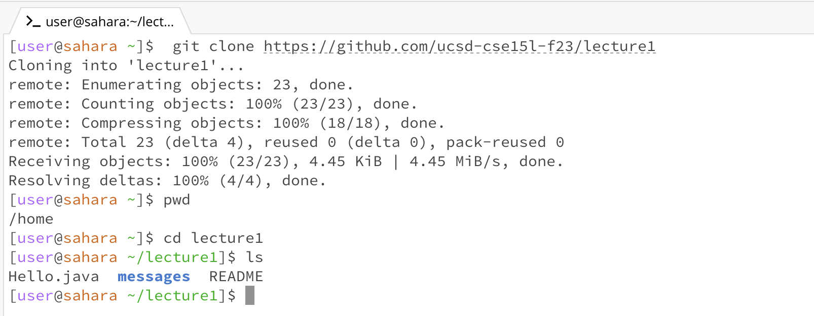
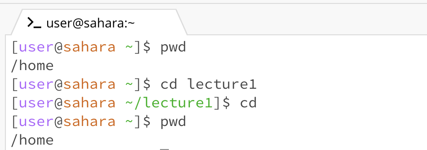
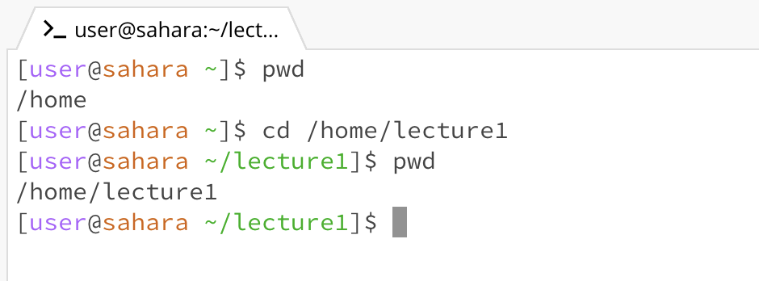
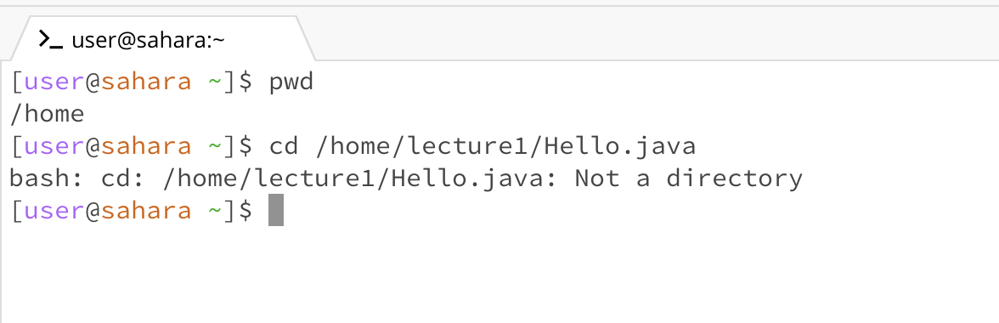
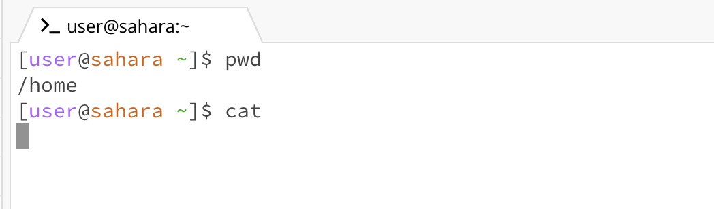
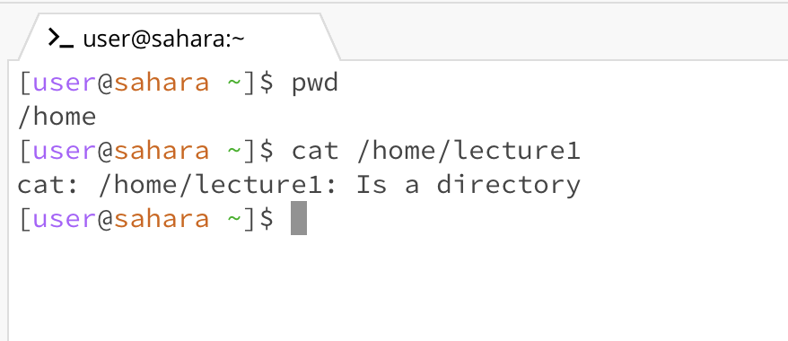
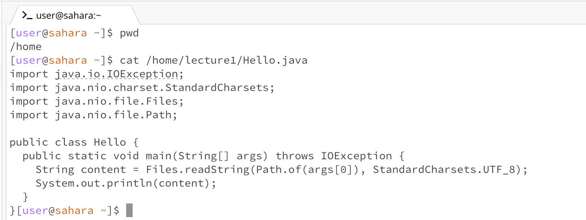

# Blog Post for Commands Using 
**I am Zheng Guo, and this is the first lab report.**
**In this report, I will introduce and explain three commands with their application and corresponding explanation**
## ls
1. Share an example of using the command with no arguments.

* working directory:`/home/lecture1`
* what I got:after 'ls' with no argument is called, three names 'Hello.java', 'messages' and 'README' appear in the terminal in the next line
* why I got this:the reason why these three name appear in the terminal is because 'ls' command shows the name of files and folders in the current directory
* whether the output is an errer: not an error
2. Share an exmaple of using the command with a path to a directory as an argument.

* working directory:'/home/lecture1'
* what I got:after 'ls' with argument '/home/lecture1' is called, three names 'Hello.java','messages' and 'README' appear in the terminal in the next line
* why I got this:the reason why these three name appear in the terminal is because 'ls' command shows the name of files and folders in the directory passed by the argument
* whether the output is an errer: not an error
3. Share an example of using the command with a path to a file as an argument.

* working directory:'/home/lecture1'
* what I got:after 'ls' with argument '/home/lecture1/Hello.java' is called, '/home/lecture1/Hello.java' appear in the terminal in the next line
* why I got this:the reason why '/home/lecture1/Hello.java' is gotten is because 'ls' command is used to list the contents of a directory, and when a specific file path is provided to it, it confirms the existence of that file.
* whether the output is an errer: not an error

---
## cd
1. Share an example of using the command with no arguments.

* working directory:'/home/lecture1'
* what I got:when 'cd' with no argument is called the working directory secified before the '$' changes from 'user@sahara ~/lecture1' to 'user@sahara ~'
* why I got this:the reason why there is a change before the '$' is because 'cd' with no argument will change the directory to the home directory. 
* whether the output is an errer: not an error
2. Share an exmaple of using the command with a path to a directory as an argument.

* working directory:'/home'
* what I got:after cd with argument '/home/lecture1' is called, the working directory secified before the '$' changes from 'user@sahara ~' to  'user@sahara ~/lecture1'
* why I got this:the reason why there is a change before the '$' is because 'cd' with the argument to a directory will change the working directory to the directory same as the argument. 
* whether the output is an errer: not an error
3. Share an example of using the command with a path to a file as an argument.

* working directory:'/home/lecture1'
* what I got:bash: :after 'cd' with argument '/home/lecture1/Hello.java' is called 'cd: /home/lecture1/Hello.java: Not a directory' appears in the terminal next line.
* why I got this:the reason why 'cd: /home/lecture1/Hello.java: Not a directory' is because 'cd' is a command to change the working directory, not files. Then, path to a file is a invalid argument for 'cd'.
* whether the output is an errer: not an error

---
## cat
1. Share an example of using the command with no arguments.

* working directory:'/home'
* what I got:when 'cat' with no arguments is called, nothing appears in the terminal.
* why I got this:the reason why nothing appears in the terminal is because 'cat' primary purpose is to display the content of files. If there is no path provided for 'cat' command, it will wait for you to type some text as input to print out. 
* whether the output is an errer: not an error
2. Share an exmaple of using the command with a path to a directory as an argument.

* working directory:'/home'
* what I got:after 'cat' with argument '/home/lecture1' is called, 'cat: /home/lecture1: Is a directory' appears in the terminal in the next line. 
* why I got this:The reason why 'cat: /home/lecture1: Is a directory' appears is because 'cat' command is designed to display the contents of files, and it cannot display the contents of a directory in a meaningful way.The message 'cat: /home/lecture1: Is a directory' indicates that '/home/lecture1' is a directory, not a regular file. 
* whether the output is an errer: not an error
3. Share an example of using the command with a path to a file as an argument.

* working directory:'/home'
* what I got:after 'cat' with argument '/home/lecture1/Hello.java', content in the 'Hello.java' file get printed out in the terminal
* why I got this:the reason why content in the 'Hello.java' file get printed out in the terminal is because when the path to a file is provided to 'cat' command, 'cat' will display the contents of the file
* whether the output is an errer: not an error
