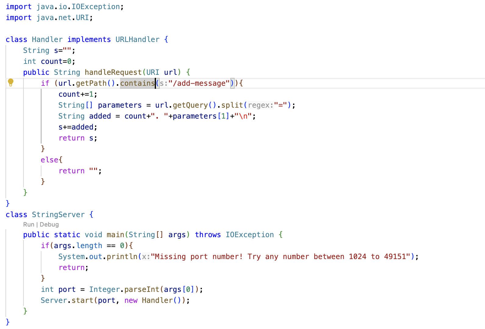
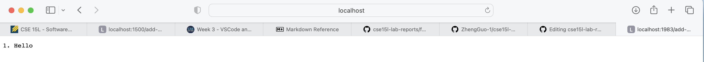
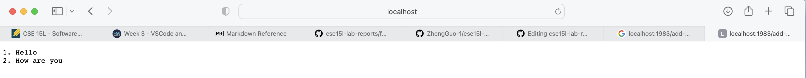
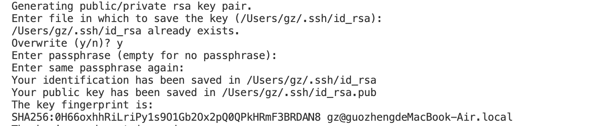
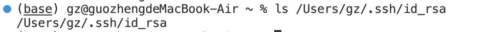
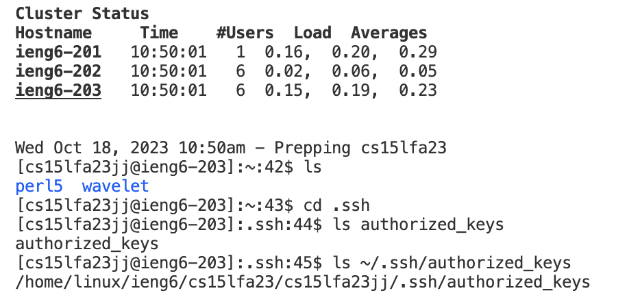
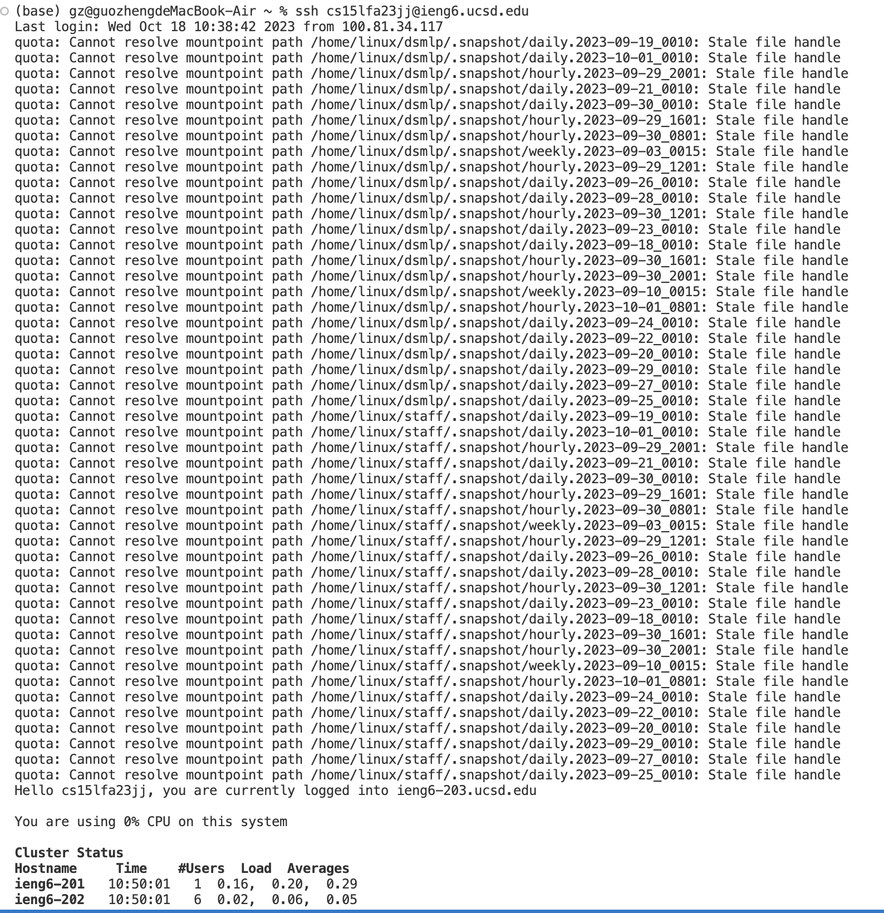

# Blog Post for Servers and SSH Keys 
**I am Zheng Guo, and this is the second lab report.**
**In this report, I will introduce and explain the string servers that I creaed. Also, I will show the path of private key and public key in my own computer and ieng6**
# Part 1
Code for the String Server:
First Screenshot of `/add-message`: 
1. Method that is called: start in the server class is called and handleRequest in the handler class is called.
2. For the start method, the arguments are 1983 and `new Handler()`. For the handleRequest method, the argument is the URL http://localhost:1983/add-message?s=Hello. The field `s` originally has the value of empty string. After the first iteration `s` becomes the conbimation of three strings:"1. "+"Hello"+"\n". The field `count` originally has the integer value of 0. After the first iteration `count` becomes 1.
3. `s` changes from empty to ""1. "+"Hello"+"\n"", and `count` changes from 0 to 1.

---
Second Screenshot of `/add-message`: 
1. Method that is called: start in the server class is called and handleRequest in the handler class is called.
2. For the start method, the arguments are 1983 and `new Handler()`. For the handleRequest method, the argument is the URL http://localhost:1983/add-message?s=How are you. The field `s` originally has the value of ""1. "+"Hello"+"\n"". After the second iteration `s` becomes the ""1. "+"Hello"+"\n+"2. "+"How are you"+"\n"". The field `count` originally has the integer value of 1. After the first iteration `count` becomes 2.
3. `s` changes from ""1. "+"Hello"+"\n"" to ""1. "+"Hello"+"\n+"2. "+"How are you"+"\n"", and `count` changes from 1 to 2.

---
# Part 2
The path to the private key for your `ssh` key for logging into `ieng6` (on your computer or on the home directory of the lab computer)

---
The path to the public key for your SSH key for logging into ieng6 (within your account on ieng6)

---
A terminal interaction where you log into ieng6 with your course-specific account without being asked for a password.

---
# Part 2
The first thing that I did not know before is that I can use `ssh` to connected to a computer in the CSE basement in my own computer. Once I connect to the remote server, I can check the folders and files in the server, which is cool and new for me. 
The second thing that I did not know before is that I can use the java code to create a web server. The webpages generated from the server depends on the path and query in the URL.
