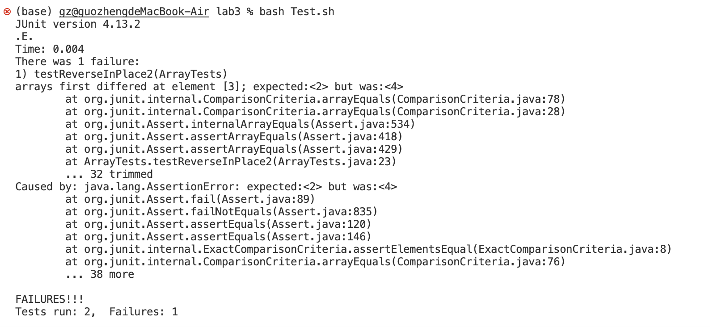

# Blog Post for Bugs and Commands
**I am Zheng Guo, and this is the third lab report.**
**In this report, I will introduce a bug from week 4's lab and explain the failure-inducing input, symptom and code fixing. Also I will introduce a specific command find and gives several examples.**
# Part 1 Bugs(reverseInPlace in ArrayExamples.java)
The code for the reverseInPlace method: 
```
static void reverseInPlace(int[] arr) {
    for(int i = 0; i < arr.length; i += 1) {
        arr[i] = arr[arr.length - i - 1];
    }
}
```

---

The code for the test with inputs that induces bugs: 
```
@Test
public void testReverseInPlace2() {
    int[] input1 = {1,2,3,4,5};
    ArrayExamples.reverseInPlace(input1);
    assertArrayEquals(new int[]{5,4,3,2,1}, input1);
}
```
Failure-inducing input:{1,2,3,4,5}

---

The code for the test with inputs that does not induce bugs: 
```
@Test 
public void testReverseInPlace() {
    int[] input1 = {3};
    ArrayExamples.reverseInPlace(input1);
    assertArrayEquals(new int[]{3}, input1);
}
```
An input that doesn’t induce a failure: {3}

---

The symptom, as the output of running the tests:


---

Code before:
```
static void reverseInPlace(int[] arr) {
    for(int i = 0; i < arr.length; i += 1) {
        arr[i] = arr[arr.length - i - 1];
    }
}
```

Code after:
```
static void reverseInPlace(int[] arr) {
    int[]temporary = Arrays.copyOf(arr, arr.length);
    for(int i = 0; i < arr.length; i += 1) {
        arr[i] = temporary[arr.length - i - 1];
    }
}
```
Reason why the fix addresses the issues:
The problem for the reverseInPlace is that the method directly change value in the list, changing the value for index 0 to the last element, and value for index 1 to the second last element, when iterates the value for index 3, it should replace this value with the original 2 in the index 1. However, value for index 1 is not 2 anymore. The reason why the fix addresses the issues is becasue it introduces a copy of the original array, and change the array itself based on the reverse order of the copy. Since the copy version is not changed, the issues occured in the original code will not happen. 

# Part 2 Researching Commands-find
Option 1: Search for a file with a specific name in a specific directory. Found from https://www.geeksforgeeks.org/find-command-in-linux-with-examples/
a. 
commands: `find technical -name "chapter-1.txt"`
output: `technical/911report/chapter-1.txt`
b. 
commands: `find technical -name "1468-6708-3-1.txt"`
output: `technical/biomed/1468-6708-3-1.txt`

This option searches a file with name in a directory. This is useful because it can help us confirm the existance of the file in that directory.

Option 2: Search for all directories in a specific directory. Found from https://www.geeksforgeeks.org/find-command-in-linux-with-examples/
a.
commands: `find technical -type d`
output: 
```
technical
technical/government
technical/government/About_LSC
technical/government/Env_Prot_Agen
technical/government/Alcohol_Problems
technical/government/Gen_Account_Office
technical/government/Post_Rate_Comm
technical/government/Media
technical/plos
technical/biomed
technical/911report
```
b.
commands: `find technical/government -type d`
output: 
```
technical/government
technical/government/About_LSC
technical/government/Env_Prot_Agen
technical/government/Alcohol_Problems
technical/government/Gen_Account_Office
technical/government/Post_Rate_Comm
technical/government/Media
```

This option displays all directoris in the specific directories. This is useful because it can help us to see the directory structure. 

option 3: Search text within multiple files. Found from https://www.geeksforgeeks.org/find-command-in-linux-with-examples/
a.
commands: ` find ./ -type f -name "*.txt" -exec grep 'EXECUTIVE'  {} \;`
output: 
```
EXECUTIVE SUMMARY
EXECUTIVE SUMMARY - THE CLEAR SKIES INITIATIVE
SERVICE AND EXECUTIVE OFFICE FOR IMMIGRATION REVIEW ENTITLED
EXECUTIVE GUIDE
EXECUTIVE COMPENSATION:
```
b. 
commands: `find ./ -type f -name "*.txt" -exec grep 'APRIL'  {} \;`
output: `A SPECIAL REPORT to CONGRESS�APRIL 30, 2000`

This option is to print lines which have the specific words. This is useful because it can help us to see how many lines containing the words that we care. 

option 4: search files with specific pattern. Found from https://www.geeksforgeeks.org/find-command-in-linux-with-examples/
a.
commands:`find technical/911report -name "*.txt"`
output:
```
technical/911report/chapter-13.4.txt
technical/911report/chapter-13.5.txt
technical/911report/chapter-13.1.txt
technical/911report/chapter-13.2.txt
technical/911report/chapter-13.3.txt
technical/911report/chapter-3.txt
technical/911report/chapter-2.txt
technical/911report/chapter-1.txt
technical/911report/chapter-5.txt
technical/911report/chapter-6.txt
technical/911report/chapter-7.txt
technical/911report/chapter-9.txt
technical/911report/chapter-8.txt
technical/911report/preface.txt
technical/911report/chapter-12.txt
technical/911report/chapter-10.txt
technical/911report/chapter-11.txt
```
b.
commands: `find lib -name "*.jar"`
output:
```
lib/junit-4.13.2.jar
lib/hamcrest-core-1.3.jar
```
This option is to list all the files with same pattern in a specific directory. This is useful because it can help us to display all same type of files clearly. 


