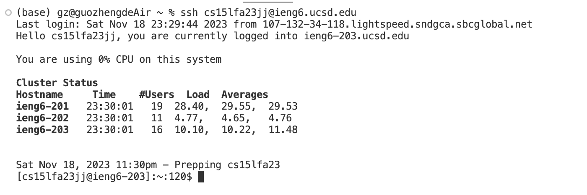
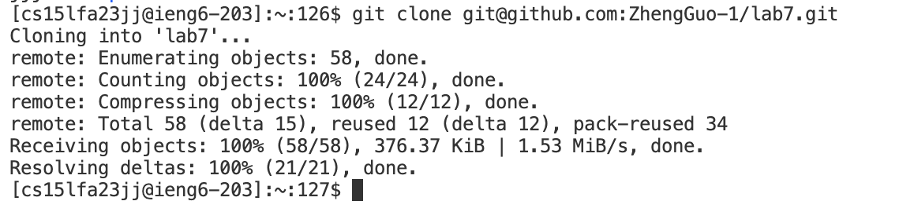
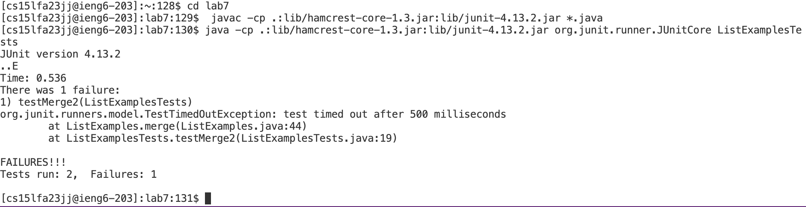

# Blog Post Vim
**I am Zheng Guo, and this is the fourth lab report.**
**In this report, I will reproduce the task 4-9 in the lab and for each numbered step starting right after the timer (so steps 4-9), I will take a screenshot, and write down exactly which keys I pressed to get to that step. 
# Step 1 Log into ieng6

Keys pressed: 
1. I firstly type `ssh cs15lfa23jj@ieng6.ucsd.edu` and I `<enter>` to let the command run. The summarization of this command and the effect of the keypresses are that I use `ssh` with the course specific account to do the remotely connecting and get access to the remote server in the ieng6.

---

# Step 2 Clone your fork of the repository from your Github account (using the SSH URL)

Keys pressed:
1. I firstly type `git clone git@github.com:ZhengGuo-1/lab7.git` and I `<enter>` to let the command run. The summarization of this command and the effect of the keypresses are that I use the ssh URL for the lab7 repository for the git clone in order to clone the repository in the current working directory in the remote server in the ieng6.

---

# Step 3 Run the tests, demonstrating that they fail

Keys pressed:
1. I type `cd lab7` and I `<enter>` to let the command run. The summarization of this command and the effect of the keypresses are that I change the current working directory to the lab7 directory in order to compile java files and run test files later. 
2. I type `<up><up><up><up><up><up><up><up><up>` and I `<enter>`. The summarization of the effect of the keypresses is that I use nine up arrows to get access to the command to compile all java files in the current working diretory since `javac -cp .:lib/hamcrest-core-1.3.jar:lib/junit-4.13.2.jar *.java` command was 9 up in the search history.
3. I type  `<up><up><up><up><up><up><up><up>` and I `<enter>`. The summarization of the effect of the keypresses is that I use eight up arrows to get access to the command to run the test java files in the current working diretory since `java -cp .:lib/hamcrest-core-1.3.jar:lib/junit-4.13.2.jar org.junit.runner.JUnitCore ListExamplesTests` command was 8 up in the search history. After I run the test java files, the Junit test output will be shown in the terminal

---

# Step 4 Edit the code file to fix the failing test

Keys pressed:
1. I type `vim ListExamples.java` and I `<enter>` to let the command run. The summarization of this command is that I open the content of this java file in vim in order to do the edit later.
2. I type `43j`. The effect of the keypresses are that I move the cursor to be the front of the line which is 43 lines down from the first line in the java file.
3. I type `e`. The effect of the keypress is that I move the cursor to the end of the current work, which is now under the 1.
4. I type `c2`. The effect of the keypresses are that I change the character that is under the cursor to be 2, which is exactly the correct edit.
5. I type `:wq!`. The effect of the keypresses are that I save the change and exit the vim. 
