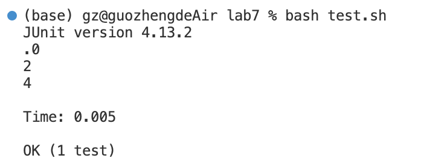
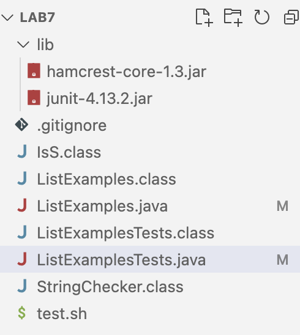
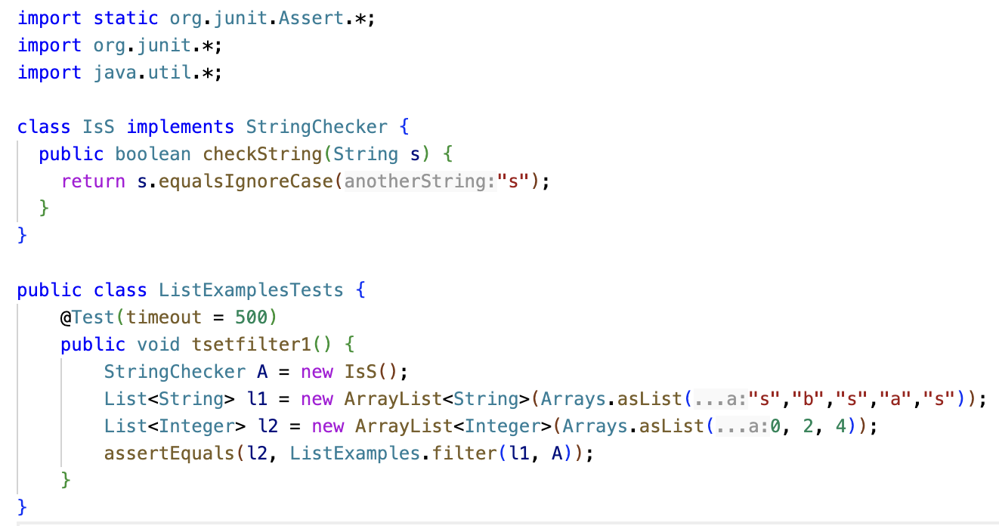
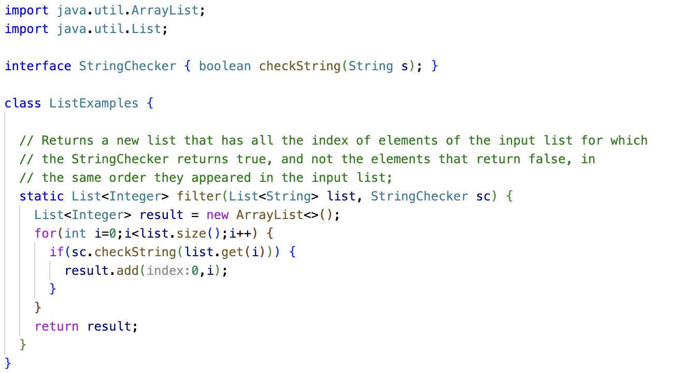
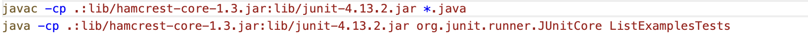

# Blog Post Vim
**I am Zheng Guo, and this is the fifth lab report.**
**In this report, I will design Debugging Scenario, and write a report as a conversation on EdStem.**

# Part 1 Debugging Scenario
1.

Description of a guess at the bug/some sense of what the failure-inducing input is: 
As we can see from the Junit test output, the expected list output is `[0, 2, 4]`. However, the actual list output is `[4, 2, 0]`, which contains the same element but with the opposite order. Therefore, we might guess that the `checkString` method is implemented correctly but the bug is probably accuring at the place where we add the index of the element which returns true in the `checkString`. The failure-inducing input is the String list provided to the filter method, which is `["s","b","s","a","s"]`.

---

2.
A response from a TA asking a leading question or suggesting a command to try:
One leading question is that whether the index of the element which returns true in the `checkString` is added at the end of the result list each time, which is crucial to retain the same order they appeared in the input list.

---

3.

A clear description of what the bug is:
The bug is that each time we add the index of the element which returns true in the `checkString`, the adding place is always in the front of the `result` list. This is a bug because index that is added late will appear in the front of the `result` list compared with the index that is added early, which violate the order they appeared in the input list.

---

4.
The file & directory structure:

The contents of each file before fixing the bug:

The full command line (or lines) you ran to trigger the bug:
bash test.sh

A description of what to edit to fix the bug:
In the ListExample.java, change `result.add(0,i);` to `result.add(i);`

# Part 2 – Reflection
One cool topic we addressed is the `git add`, `git commit`, and `git push`. These are cool because these commands allow me to modify code in my local computer and update the modification in the github online. Therefore, I can implement my project interactively online and offline. Another cool topic is `vim`, because when we do not have available editor tools, `vim` allows us to edit files in the terminal. Also, `vim` has lots of powerful tools for editing like replacing keywords at once.
