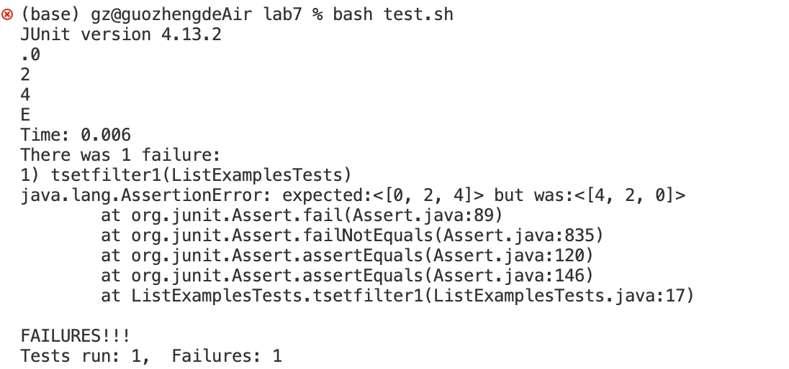

# Blog Post Vim
**I am Zheng Guo, and this is the fifth lab report.**
**In this report, I will design Debugging Scenario, and write a report as a conversation on EdStem**

# Step 1 Debugging Scenario
1.

Description of a guess at the bug/some sense of what the failure-inducing input is: 
As we can see from the Junit test output, the expected list output is `[0, 2, 4]`. However, the actual list output is `[4, 2, 0]`, which contains the same element but with the opposite order. Therefore,we might guess that the `checkString` method is implemented correctly but the bug is probably accuring at the place where we add the index of the element which returns true in the `checkString`. The failure-inducing input is the String list provided to the filter method, which is `["s","b","s","a","s"]`.

2.
A response from a TA asking a leading question or suggesting a command to try:
One leading question is that whether the index of the element which returns true in the `checkString` is added at the end of the result list each time. The suggesting command to try in this situation is that 
